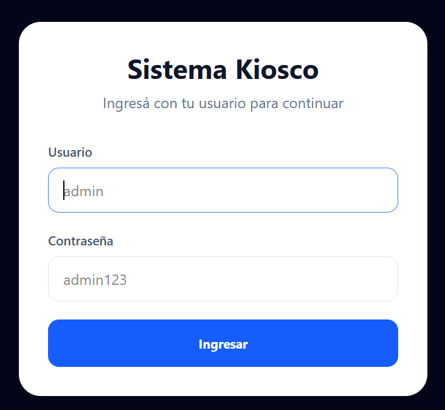
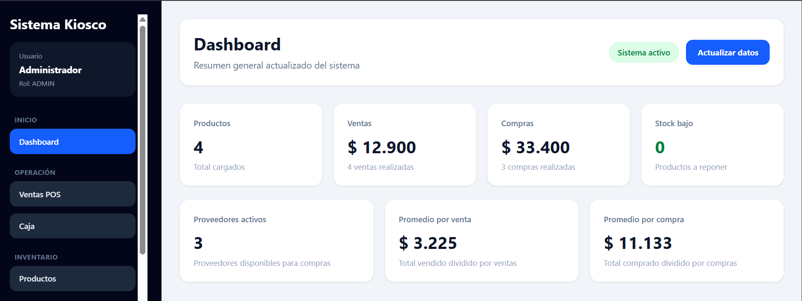
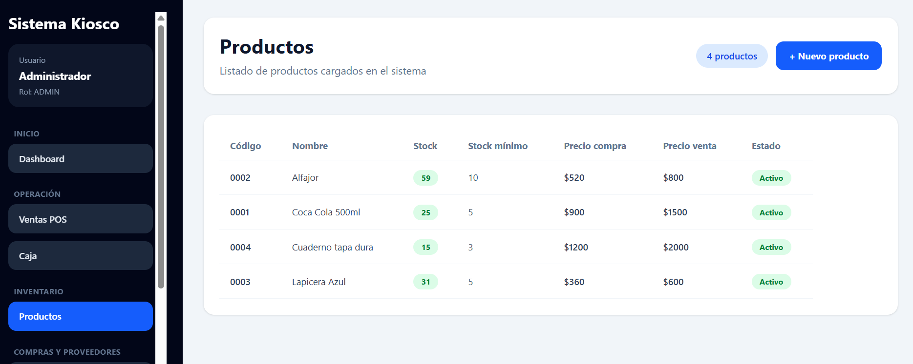
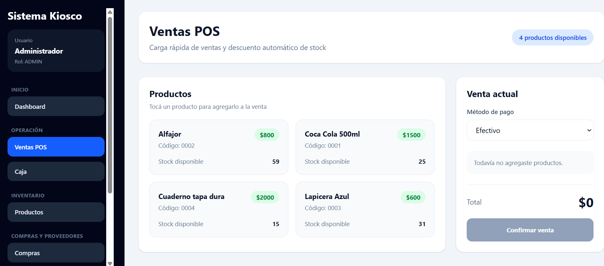
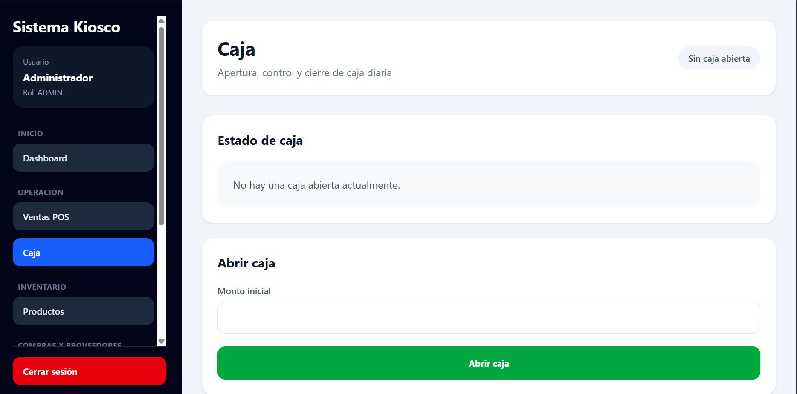
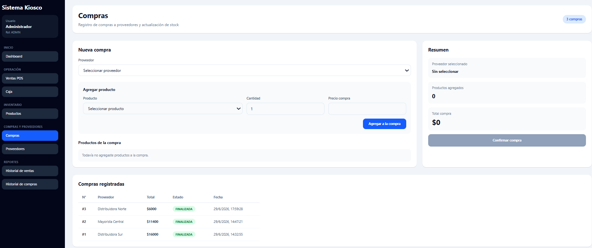
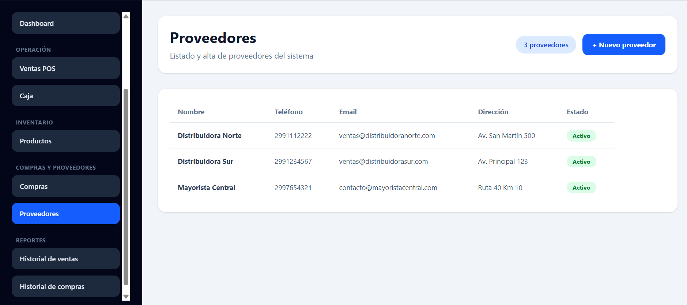
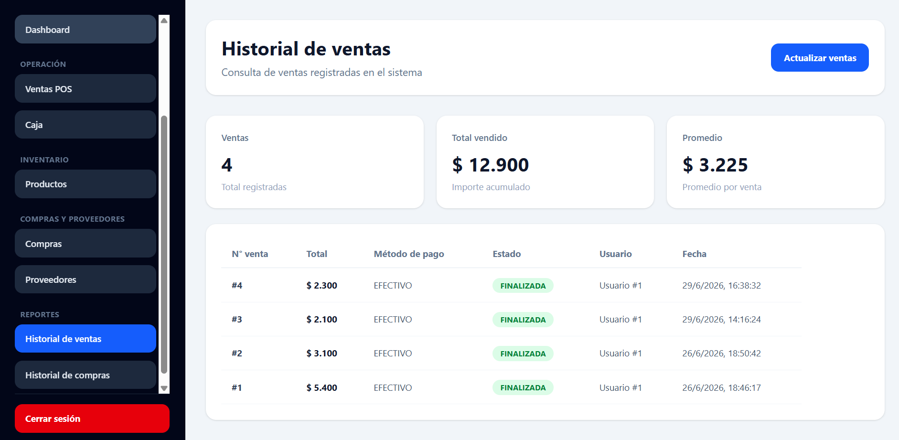
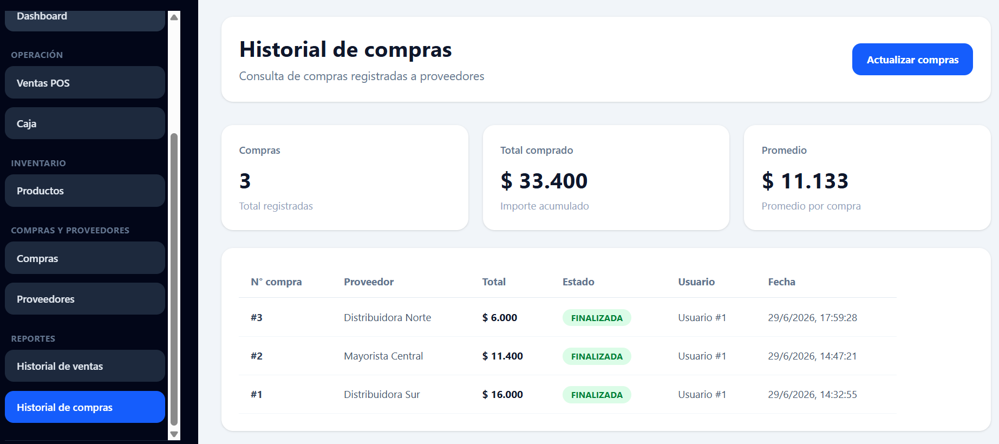

<div align="center">

# 🏪 Sistema Kiosco

### Gestión de productos, ventas, compras, proveedores y caja

[](https://react.dev/)
[](https://fastapi.tiangolo.com/)
[](https://sqlite.org/)
[](https://github.com/Rolando-Du/SistemaKiosco/actions)

</div>

---

## Descripción

Sistema full stack para la gestión integral de un **kiosco, librería e impresiones**.

Permite administrar productos y stock, registrar ventas y compras, operar la caja diaria, gestionar proveedores y consultar historiales desde una interfaz web responsive conectada a una API desarrollada con FastAPI.

---

## Funcionalidades

- Login de usuarios.
- Rutas protegidas.
- Dashboard general.
- Alta y gestión de productos.
- Control de stock.
- Ventas POS.
- Descuento automático de stock al vender.
- Historial de ventas.
- Apertura y cierre de caja.
- Gestión de proveedores.
- Registro de compras.
- Incremento automático de stock al comprar.
- Historial de compras.
- Reportes resumidos.
- Interfaz responsive.
- Integración continua con GitHub Actions.

---

## Stack

### Frontend

```text
React 19
Vite 8
Tailwind CSS 4
React Router
ESLint
```

### Backend

```text
Python 3
FastAPI
SQLAlchemy
SQLite
Uvicorn
Pydantic
bcrypt / passlib
```

---

## Arquitectura

```text
Usuario
  ↓
React + Vite
  ↓
Pages / Services
  ↓
FastAPI
  ↓
Routers / Services
  ↓
SQLAlchemy
  ↓
SQLite
```

---

## Estructura

```text
SistemaKiosco/
├── .github/
│   └── workflows/
│       └── ci.yml
├── backend/
│   ├── database/
│   ├── routers/
│   ├── seguridad/
│   ├── services/
│   ├── app.py
│   └── requirements.txt
├── frontend/
│   └── src/
│       ├── auth/
│       ├── config/
│       ├── layouts/
│       ├── pages/
│       ├── routes/
│       └── services/
├── docs/
│   └── screenshots/
├── CHANGELOG.md
└── README.md
```

---

## Instalación

### Backend

```bash
cd backend
python -m venv entorno
```

En Windows / Git Bash:

```bash
source ./entorno/Scripts/activate
```

Instalar dependencias:

```bash
pip install -r requirements.txt
```

Ejecutar:

```bash
python -m uvicorn app:app --reload
```

API:

```text
http://127.0.0.1:8000
```

Swagger:

```text
http://127.0.0.1:8000/docs
```

### Frontend

```bash
cd frontend
pnpm install
pnpm dev
```

Frontend:

```text
http://localhost:5173
```

---

## Acceso de prueba

El proyecto puede inicializar usuarios de desarrollo según la configuración local utilizada.

Por seguridad, **las contraseñas de prueba no se publican en el README**. Si se crea un usuario demo, sus credenciales deben mantenerse fuera del repositorio y cambiarse antes de compartir un ambiente accesible públicamente.

---

## Endpoints principales

```text
POST /usuarios/login

GET  /productos/
POST /productos/
GET  /productos/buscar
GET  /productos/stock-bajo

GET  /ventas/
POST /ventas/
GET  /ventas/{venta_id}

GET  /caja/abierta
POST /caja/abrir
POST /caja/cerrar

GET  /proveedores/
POST /proveedores/

GET  /compras/
POST /compras/
GET  /compras/{compra_id}

GET /reportes/resumen
```

---

## Capturas

### Login



### Dashboard



### Productos



### Ventas POS



### Caja



### Compras



### Proveedores



### Historial de ventas



### Historial de compras



---

## CI

GitHub Actions ejecuta validaciones automáticas en cada push y pull request a `master`:

```text
Backend  → instalación + compilación de fuentes Python
Frontend → instalación + lint + build
```

---

## Seguridad

- No publicar credenciales reales ni demo reutilizables.
- No versionar secretos o variables sensibles.
- Cambiar contraseñas iniciales antes de exponer un ambiente.
- Mantener dependencias actualizadas.
- Revisar los datos de la base antes de compartir copias o backups.

---

## Estado

```text
✓ autenticación
✓ dashboard
✓ productos
✓ stock
✓ ventas POS
✓ historial de ventas
✓ caja
✓ compras
✓ proveedores
✓ reportes
✓ frontend responsive
✓ API FastAPI
✓ CI
```

---

## Changelog

La evolución detallada del proyecto se encuentra en:

**[CHANGELOG.md](./CHANGELOG.md)**

---

## Autor

Desarrollado por **Rolando Duarte**.

[](https://github.com/Rolando-Du)
